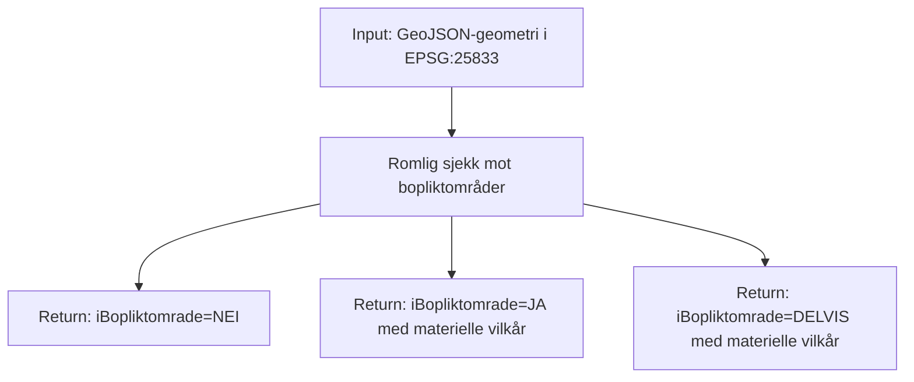
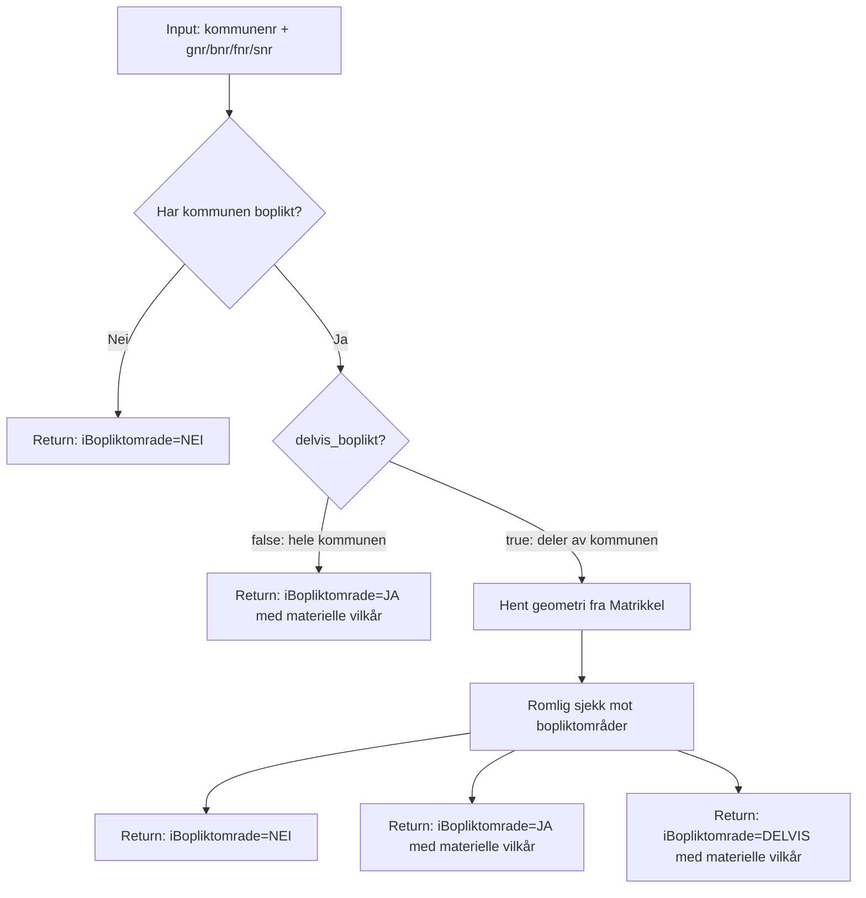

# Bopliktsjekken

## Geometri som input

Tar inn geometri og sjekker den mot alle bopliktområdene.

## Matrikkelsnummer som input

1. **Sjekk kommune** — enkel SQL på `kommunenummer` uten geometri
2. **Ingen treff** — kommunen har ikke boplikt → `nei`, ferdig
3. **Hel boplikt** — alle treff har `delvis_boplikt=false` → `ja`, ferdig
4. **Delvis boplikt** — hent teiggeometri fra Matrikkel, kjør `ST_Intersects`/`ST_Within` mot bopliktområder

## Databasetilkoblinger

Bopliktsjekken bruker `ThreadedConnectionPool` fra psycopg2 med `minconn=1` og `maxconn=2` per prosess. Poolen opprettes lazy og gjenbrukes for resten av prosessens levetid.

Gunicorn kjører med sync workers, som betyr at hver worker kun håndterer én request om gangen. I praksis brukes derfor bare **1 tilkobling per worker** samtidig, uavhengig av `maxconn`.

Reelt antall tilkoblinger: **pods × workers = aktive tilkoblinger**

| Pods | Workers | Aktive tilkoblinger | maxconn (teoretisk maks) |
|------|---------|---------------------|--------------------------|
| 3    | 4       | 12                  | 24                       |
| 5    | 4       | 20                  | 40                       |

Prod-databasen har `max_connections = 300`. Databasen deles med `kommuneinfo-api`, så den totale belastningen er høyere enn bare smia-ogc-api alene.

## Datadeling: OGC-features

* Deling av bopliktområder som OGC-features, med tilgangsstyring via API-nøkkel i dagens løsning
* Henter data fra `kommuneinfo.bopliktomraade`-tabellen og eksponerer via OGC API Features
* Viser felter slike som det er i lagret i databasen.
* Ingen transformasjon av geometri, CRS er EPSG:25833 (UTM sone 33) gjennom hele kjeden.
* Kan gjøre custom spørringer som å filtrere på kommunenummer, delvis_boplikt, eller andre attributter i tabellen.
* Kan gjøre romlige spørringer som å finne alle bopliktområder som overlapper en gitt geometri.

## Bopliktsjekk: OGC-process

* Custom OGC-process som tar inn geometri eller matrikkelsnummer og sjekker mot bopliktområder
* Kan både gjøre kall mot database og andre api-er som Matrikkel API.
* Vi styrer hva som blir returnert i svaret
* F.eks hvilke felter som skal være med i svaret, og hvordan resultatet skal struktureres
* I dagens implementasjon returneres bopliktresultat og materielle vilkår. Interne metadata fra geometrihenting (for eksempel hjelpelinjetyper) returneres ikke i API-responsen.
