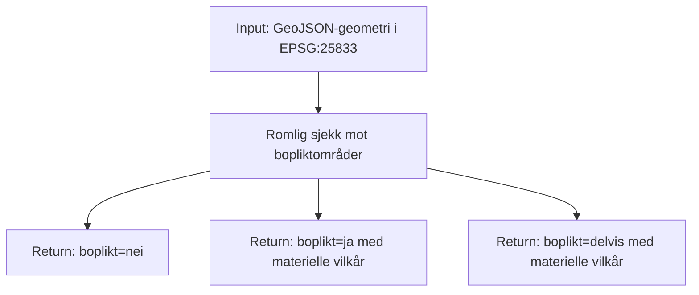
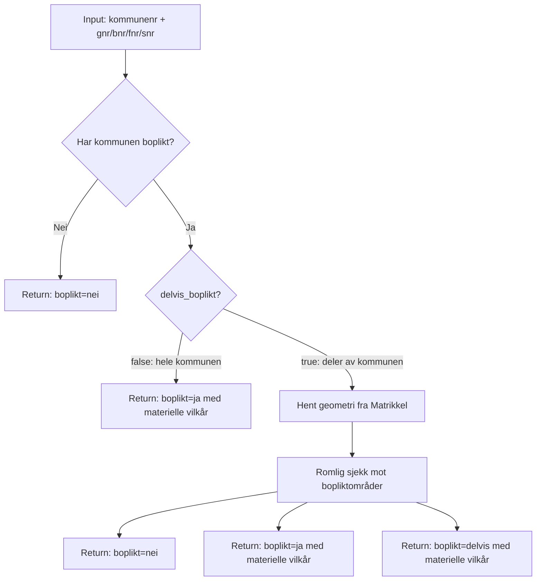

# Bopliktsjekken

## Geometri som input
Tar inn geometri og sjekker den mot alle bopliktområdene.

## Matrikkelsnummer som input
Bopliktsjekk via matrikkelsnummer. Sjekker kommunenivå først for å unngå et dyrt Matrikkel SOAP-kall når det ikke trengs.

### Vurdering rundt hente teig geometri for matrikkelenhet
* MatrikkelAPI
    * Må bygge polygoner selv
    * Sanntidsdata
* WFS
    * Forenklet geometri
* Eiendoms REST-API
    * 1 dag forsinkelse i data
    * Forenklet geometri?

### Flyt

1. **Sjekk kommune** — enkel SQL på `kommunenummer` uten geometri
2. **Ingen treff** — kommunen har ikke boplikt → `nei`, ferdig
3. **Hel boplikt** — alle treff har `delvis_boplikt=false` → `ja`, ferdig
4. **Delvis boplikt** — hent teiggeometri fra Matrikkel, kjør `ST_Intersects`/`ST_Within` mot bopliktområder

## Tilgangsstyring

### OGC-feature: Åpent for offentligheten
* OGC feature-endepunktene (`/collections/...`) er åpne — de returnerer bare forhåndslagrede data fra vår egen database og er ment for fri bruk.

### OGC-process Bopliktsjekken: Bak tilgangsstyring
- Kaller Matrikkel SOAP-API direkte
- Utfører tyngre operasjoner, geometribygging og romlig sjekk
- Kan misbrukes til høyt volum uten throttling

Forslag: ztoperator + Maskinporten
- Maskinporten gir maskin-til-maskin-autentisering uten brukerpålogging og passer godt for systemintegrasjoner
- Alternativt API-nøkkel om Maskinporten er for tung å sette opp i første omgang

## MVP: OGC med datadeling og bopliktsjekk
Det vi har gjort til nå.
* Deling av  boplikområder som OGC-features.
* Bopliktsjekk med OGC-Process
    * Input enten med geometri eller matrikkelnummer
* API-nøkkel på alle endepunkt
* Satt opp logger, metrikker og alarmer.
* Satt opp på on-prem skip og klargjort for eksponering til internett.
* Test eksponering til internett
* Gjennomføre sikkerhetssjekker.

## Ting man kan vurdere etter MVP
* Gjøre endringer basert på brukerbehov
* Gjøre OGC-features offentlig tilgjengelig.
* Bytte til ztoperator + Maskinporten for OGC-process API
* Egen database for OGC-api
* Vurdre om offentlig sky er nødvendig
* Konvertere bopliktsjekken til en ny tjeneste som kun utfører bopliktsjekken

## Databasetilkoblinger

Bopliktsjekken bruker `SimpleConnectionPool` fra psycopg2 med `minconn=1` og `maxconn=2` per prosess. Poolen opprettes lazy og gjenbrukes for resten av prosessens levetid.

Gunicorn kjører med sync workers (4 per pod), som betyr at hver worker kun håndterer én request om gangen. I praksis brukes derfor bare **1 tilkobling per worker**, uavhengig av `maxconn`.

Reelt antall tilkoblinger: **pods × workers = aktive tilkoblinger**

| Pods | Workers | Aktive tilkoblinger | maxconn (teoretisk maks) |
|------|---------|---------------------|--------------------------|
| 3    | 4       | 12                  | 24                       |
| 5    | 4       | 20                  | 40                       |

Prod-databasen har `max_connections = 300`. Databasen deles med `kommuneinfo-api`, så den totale belastningen er høyere enn bare smia-ogc-api alene.

## Datadeling: OGC-features
* Deling av bopliktområder som OGC-features, uten tilgangsstyring
* Henter data fra `kommuneinfo.bopliktomraade`-tabellen og eksponerer via OGC API Features
* Viser felter slike som det er i lagret i databasen.
* Ingen transformasjon av geometri, CRS er EPSG:25833 (UTM sone 33) gjennom hele kjeden.
* Kan gjøre custom spørringer som å filtrere på kommunenummer, delvis_boplikt, eller andre attributter i tabellen.
* Kan gjøre romlige spørringer som å finne alle bopliktområder som overlapper en gitt geometri.

## Bopliktsjekk: OGC-process
* Custom OGC-process som tar inn geometri eller matrikkelsnummer og sjekker mot bopliktområder
* Kan både gjøre kall mot database og andre api-er som Matrikkel API.
* Vi styrer hva som blir returnert i svaret
* F.eks hvilke felter som skal være med i svaret, og hvordan resultatet skal struktureres
* For matrikkelsnummer kan vi returnere både boplikt-resultatet og informasjon om teigen, som for eksempel hvilke hjelpelinjetyper som finnes på teigen.