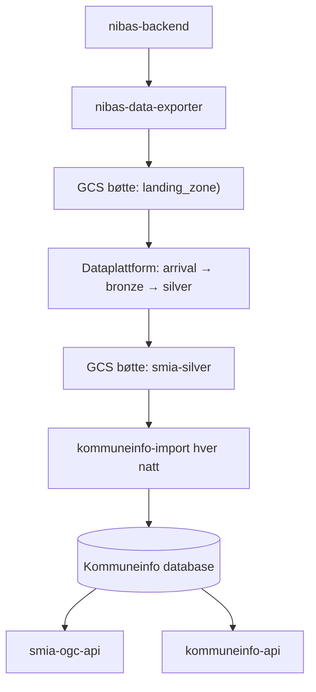

# Dataflyt

## Oversikt

Bopliktområder synkroniseres én gang per natt fra nibas via Dataplattformen inn i Kommuneinfo-databasen, som OGC APIet leser fra.

## Steg for steg

1. **nibas-data-exporter** kaller nibas-backend (`/v1/ekstern/bopliktomraader`) og laster JSON til en GCS landing zone-bøtte.
2. **Dataplattformen** trigger en jobb ved arrival. Data prosesseres gjennom bronze- og silver-steg, og silver-data skrives som GeoJSON til en ekstern GCS bøtte (`smia-silver/dagens/geojson/bopliktomraader/`).
3. **kommuneinfo-import** kjører kl. 02:00 hver natt. Leser silver GeoJSON fra GCS-bøtta og administrative inndelinger fra smia-silver GCS-bøtte. Importerer til et midlertidig schema og gjør en atomisk schema swap. NB! Både dev og prod kommuneinfo-import leser fra smia-silver i Databricks prod.
4. **smia-ogc-api** leser direkte fra `kommuneinfo.bopliktomraade`-tabellen og eksponerer dataene som OGC API Features + en prosess for bopliktsjekk mot geometri.

## Viktig å vite

- I nibas kan man registrere fremtidig gyldighetsdato på bopliktområder. Eksporteren henter både dagens og fremtidige data. Endringer trer i kraft automatisk neste natt når importen kjører.
- OGC APIet deler database med `kommuneinfo-api` — viktig å monitorere databasebelastning.
- OGC APIet bruker kun "dagens" datasett (`smia-silver/dagens/geojson/bopliktomraader/`), ikke fremtidige data.
- CRS er EPSG:25833 (UTM sone 33) gjennom hele kjeden, ingen transformasjon underveis.
